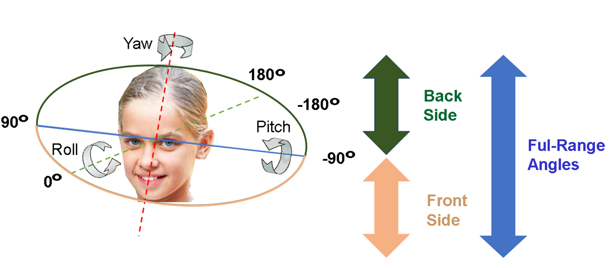
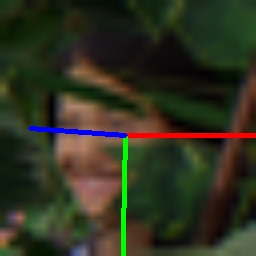
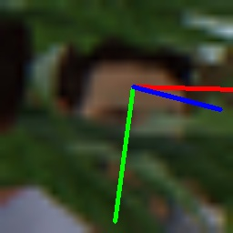
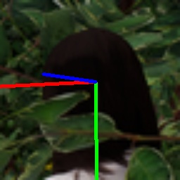
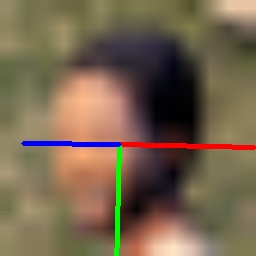
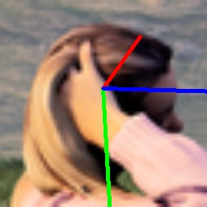
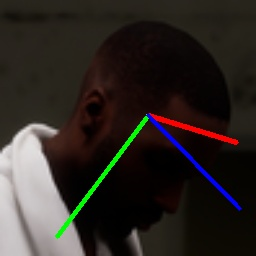
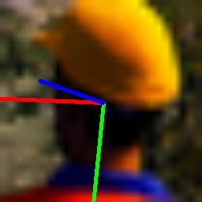
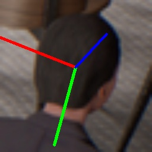

# WQuatNet
**WQuatNet: Wide range quaternion-based head pose estimation [here](https://link.springer.com/article/10.1007/s44443-025-00034-1)**


<table>
<tr>
<td></td>

</tr>
</table>
* **Fig.** shows the difference between the narrow and full ranges.


# Results visualization


<table>
<tr>
<td></td>
<td></td> 
<td></td> 
<td></td> 
<td></td>
<td></td> 
<td></td> 
<td></td> 
</tr>
</table>

* **Fig.** Snapshots of 8 different views from one sequence in the AGORA Panoptic val-set dataset.


## **Our results**
* **Table 1: MAE values for the CMU dataset obtained using different methods for Narrow-range angles: −90◦ < yaw < 90◦.**

| Method          | Retrain? | Yaw      | Pitch    | Roll     | MAE      |
| --------------- | -------- | -------- | -------- | -------- | -------- |
| DirectMHP       | Yes      | 5.86     | 8.25     | 7.25     | 7.12     |
| DirectMHP       | No       | 5.75     | 8.01     | 6.96     | 6.91     |
| 6DRepNet        | Yes      | 5.20     | 7.22     | 6.00     | 6.14     |
| 6DoF-HPE (ours) | Yes      | **5.13** | **6.99** | **5.77** | **5.96** |
| WQuatNet (ours) | Yes      | **4.67** | **6.77** | **5.42** | **5.62** |

* **Table 1: MAE values for the CMU dataset obtained using different methods for Full-range angles: −180◦ < yaw < 180◦.**

  
| Method          | Retrain? | Yaw      | Pitch    | Roll     | MAE      |
| --------------- | -------- | -------- | -------- | -------- | -------- |
| Viet et al.     | No       | 9.55     | 11.29    | 8.32     | 9.72     |
| DirectMHP       | Yes      | 7.38     | 8.56     | 7.47     | 7.80     |
| DirectMHP       | No       | 7.32     | 8.54     | 7.35     | 7.74     |
| WHENet          | No       | 8.51     | 7.67     | 6.78     | 7.65     |
| Cobo et al.     | No       | –        | –        | –        | 7.45     |
| 6DRepNet        | Yes      | 5.89     | 7.76     | 6.39     | 6.68     |
| 6DoF-HPE (ours) | Yes      | **5.83** | **7.63** | 6.35     | **6.60** |
| WQuatNet (ours) | Yes      | 6.04     | 7.72     | **6.34** | 6.70     |


* **Table 2: MAE values for the AGORA dataset obtained using different methods for Narrow-range angles: −90◦ < yaw < 90◦.**

| Method              | Retrain? | RR | Yaw       | Pitch    | Roll     | MAE       |
| ------------------- | -------- | -- | --------- | -------- | -------- | --------- |
| DirectMHP           | ✅        | E  | 12.10     | 12.86    | 11.43    | 12.13     |
| 6DoF-HPE (ours)     | ✅        | 6D | 13.92     | 10.66    | 10.24    | 11.61     |
| 6DRepNet            | ✅        | 6D | 13.03     | 10.51    | 10.25    | 11.26     |
| DirectMHP           | ❌        | E  | 11.19     | 9.89     | 10.46    | 10.51     |
| **WQuatNet (ours)** | ✅        | Q  | **10.66** | **9.99** | **9.60** | **10.08** |


* **Table 2: MAE values for the AGORA dataset obtained using different methods for Full-range angles: −180◦ < yaw < 180◦.**

| Method              | Retrain? | RR | Yaw       | Pitch     | Roll      | MAE       |
| ------------------- | -------- | -- | --------- | --------- | --------- | --------- |
| DirectMHP           | ✅        | E  | 13.39     | 15.68     | 12.08     | 13.72     |
| 6DoF-HPE (ours)     | ✅        | 6D | 15.07     | 11.74     | 11.04     | 12.62     |
| 6DRepNet            | ✅        | 6D | 14.67     | **11.57** | 10.92     | 12.39     |
| DirectMHP           | ❌        | E  | **12.28** | 12.42     | 11.02     | 11.91     |
| **WQuatNet (ours)** | ✅        | Q  | 12.84     | 11.58     | **10.80** | **11.74** |


* **Table 3: MAE values for the BIWI and AFLW2000 datasets using different methods.**

| Method               | R | RR | AFLW2000 Yaw | Pitch    | Roll     | MAE      | BIWI Yaw | Pitch    | Roll     | MAE      |
| -------------------- | - | -- | ------------ | -------- | -------- | -------- | -------- | -------- | -------- | -------- |
| HopeNet              | ❌ | E  | 6.47         | 6.56     | 5.44     | 6.16     | 4.81     | 6.60     | 3.27     | 4.89     |
| FSA-Net              | ❌ | E  | 4.50         | 6.08     | 4.64     | 5.07     | 4.27     | 4.96     | 2.76     | 4.00     |
| WHENet               | ❌ | E  | 4.44         | 5.75     | 4.31     | 4.83     | 3.60     | 4.10     | 2.73     | 3.48     |
| TokenHPE             | ❌ | RM | 4.36         | 5.54     | 4.08     | 4.66     | 3.95     | 4.51     | 2.71     | 3.72     |
| QuatNet              | ❌ | Q  | 3.97         | 5.62     | 3.92     | 4.50     | 4.01     | 5.49     | 2.94     | 4.15     |
| MFDNet               | ❌ | RM | 4.30         | 5.16     | 3.69     | 4.38     | 3.40     | 4.68     | 2.77     | 3.62     |
| Srnet                | ❌ | Q  | 3.75         | 5.10     | 3.46     | 4.10     | 3.81     | 4.36     | 2.77     | 3.65     |
| DirectMHP            | ❌ | E  | **2.99**     | 5.35     | 3.77     | 4.04     | 3.57     | 5.47     | 4.02     | 4.35     |
| Li et al. 2022       | ❌ | RM | 3.36         | 5.05     | 3.56     | 3.99     | 3.59     | **3.94** | 2.68     | **3.40** |
| 6DRepNet             | ❌ | 6D | 3.63         | 4.91     | 3.37     | 3.97     | **3.24** | 4.48     | 2.68     | 3.47     |
| FSA-Net (retrained)  | ✅ | E  | 5.41         | 6.82     | 5.42     | 5.88     | 4.74     | 5.32     | 3.26     | 4.44     |
| 6DRepNet (retrained) | ✅ | 6D | 3.50         | 4.81     | 3.47     | 3.93     | 3.79     | 4.53     | 2.89     | 3.74     |
| 6DoF-HPE (ours)      | ✅ | 6D | 3.56         | 4.74     | 3.35     | 3.88     | 3.91     | 4.43     | 2.69     | 3.68     |
| **WQuatNet (ours)**  | ✅ | Q  | 3.39         | **4.62** | **3.23** | **3.75** | 3.91     | 4.20     | **2.64** | 3.58     |


* **Table 4: MAE values for the BIWI dataset (split in a 70:30 ratio) using different methods.**


| Method              | RR | Yaw      | Pitch    | Roll     | MAE      |
| ------------------- | -- | -------- | -------- | -------- | -------- |
| FSA-Net             | E  | 2.89     | 4.29     | 3.60     | 3.59     |
| HopeNet             | E  | 3.29     | 3.39     | 3.00     | 3.23     |
| MFDNet              | RM | 2.99     | 3.68     | 2.99     | 3.22     |
| SRNet               | Q  | 3.01     | 2.78     | 2.86     | 2.88     |
| 6DRepNet            | 6D | 2.69     | 2.92     | 2.36     | 2.66     |
| TokenHPE            | RM | 3.01     | **2.28** | **2.01** | 2.43     |
| **WQuatNet (ours)** | Q  | **2.39** | 2.37     | 2.08     | **2.28** |


# Datasets

* **CMU Panoptic**  from [here](http://domedb.perception.cs.cmu.edu/) for the full range angles.
  
* **300W-LP**, and **AFLW2000** from [here](http://www.cbsr.ia.ac.cn/users/xiangyuzhu/projects/3DDFA/main.htm) for the narrow range angles.

* **BIWI**  from [here](https://icu.ee.ethz.ch/research/datsets.html) for the narrow range angles.

  


## **Training for rotational (yaw, pitch, and roll)  components**:

If you **only** need to change the pre-trained RepVGG model '**RepVGG-D2se-200epochs-train.pth**' please see [here](https://drive.google.com/drive/folders/1Avome4KvNp0Lqh2QwhXO6L5URQjzCjUq) and save it in the root directory.


```
python3 train.py
```

After training is done. Next step.

##  **Deploy models for rotational (yaw, pitch, and roll)  components**:

For reparameterization, the trained models into inference models use the convert script.

```
python3 convert.py input-model.tar output-model.pth
```

After converting the training model into an inference model. 
Then, you can test your model.


## **Testing for rotational (yaw, pitch, and roll)  components**:

```
python3 test.py
```


# Citing

```
@article{algabri2025wquatnet,
  title={WQuatNet: Wide range quaternion-based head pose estimation},
  author={Algabri, Redhwan and Shin, Hyunsoo and Abdu, Ahmed and Bae, Ji-Hun and Lee, Sungon},
  journal={Journal of King Saud University Computer and Information Sciences},
  volume={37},
  number={3},
  pages={24},
  year={2025},
  publisher={Springer}
}
```
